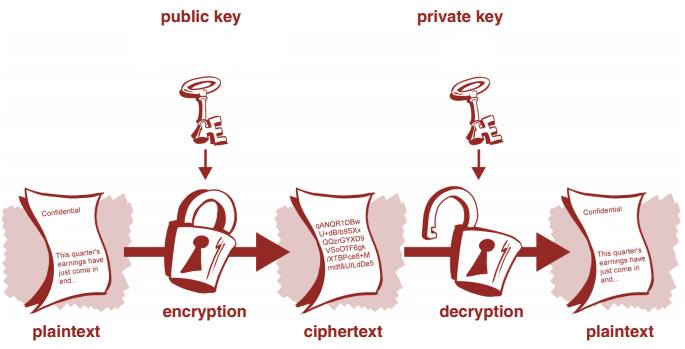

#### Asymmetric Cryptography

Public-key cryptography, or asymmetric cryptography, is any cryptographic system
that uses pairs of keys: public keys which may be disseminated widely, and
private keys which are known only to the owner. This accomplishes two functions:
authentication, where the public key verifies that a holder of the paired
private key sent the message, and encryption, where only the paired private key
holder can decrypt the message encrypted with the public key.

Because of the computational complexity of asymmetric encryption, it is usually
used only for small blocks of data, typically the transfer of a symmetric
encryption key (e.g. a session key). This symmetric key is then used to encrypt
the rest of the potentially long message sequence. The symmetric
encryption/decryption is based on simpler algorithms and is much faster.

