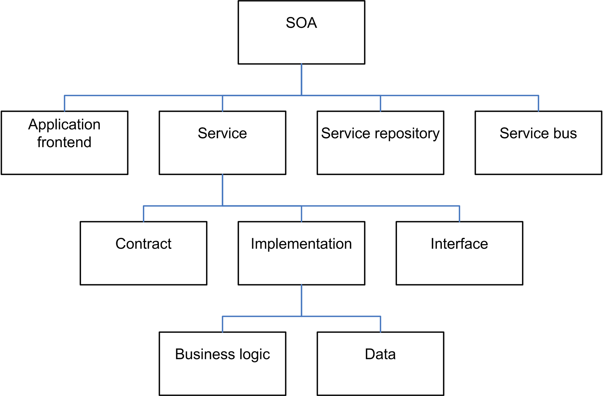

### Architectural styles

#### Major areas

| Category | Architecture styles |
| --------|
| Communication | Service-Oriented Architecture (SOA), Message Bus |
| Deployment | Client/Server, N-Tier, 3-Tier |
| Domain | Domain Driven Design |
| Structure | Component-Based, Object-Oriented, Layered Architecture |

#### Styles

##### Client - Server

- Example: 1 server, multiple clients. Also known as 2-Tier architecture.
- Advantages:
  - Higher security. All data is stored on the server, which generally offers a
  greater control of security than client machines.
  - Centralized data access. Because data is stored only on the server, access
  and updates to the data are far easier to administer than in other
  architectural styles.
  - Ease of maintenance. Roles and responsibilities of a computing system are
  distributed among several servers that are known to each other through a
  network. This ensures that a client remains unaware and unaffected by a server
  repair, upgrade, or relocation.

- The traditional 2-Tier client/server architectural style has numerous
disadvantages, including the tendency for application data and business logic
to be closely combined on the server, which can negatively impact system
extensibility and scalability, and its dependence on a central server, which can
negatively impact system reliability. To address these issues, the client-server
architectural style has evolved into the more general 3-Tier (or N-Tier)
architectural style, described below, which overcomes some of the disadvantages
inherent in the 2-Tier client-server architecture and provides additional
benefits.

##### Component-Based

- Third-party

##### DDD

- For complex systems that can improve upon good communication and modularity.
- Main Advantages:
  - Communication. All parties within a development team can use the domain
  model and the entities it defines to communicate business knowledge and
  requirements using a common business domain language, without requiring
  technical jargon.
  - Extensible. The domain model is often modular and flexible, making it easy
  to update and extend as conditions and requirements change.
  - Testable. The domain model objects are loosely coupled and cohesive,
  allowing them to be more easily tested.

- [Go to page](ddd/ddd.md)

##### Layered Architectural Style

- [Go to page](layer/layer_architecture.md)

##### Message bus

- Message bus architecture describes the principle of using a software system
that can receive and send messages using one or more communication channels, so
that applications can interact without needing to know specific details about
each other.

##### N-Tier / 3-Tier

- N-tier and 3-tier are architectural deployment styles that describe the
separation of functionality into segments in much the same way as the layered
style, but with each segment being a tier that can be located on a physically
separate computer. They evolved through the component-oriented approach,
generally using platform specific methods for communication instead of a
message-based approach.

- An example of the N-tier/3-tier architectural style is a typical financial Web
application where security is important. The business layer must be deployed
behind a firewall, which forces the deployment of the presentation layer on a
separate tier in the perimeter network.

- Another example is a typical rich client connected application, where the
presentation layer is deployed on client machines and the business layer and
data access layer are deployed on one or more server tiers.

##### Object-Oriented

- Object-oriented architecture is a design paradigm based on the division of
responsibilities for an application or system into individual reusable and
self-sufficient objects, each containing the data and the behavior relevant to
the object.

- An object-oriented design views a system as a series of cooperating objects,
instead of a set of routines or procedural instructions. Objects are discrete,
independent, and loosely coupled; they communicate through interfaces, by
calling methods or accessing properties in other objects, and by sending and
receiving messages.

##### Service-Oriented Architecture (SOA)

- Abbreviated SOA, Service-Oriented Architecture is an application architecture
in which all functions, or services, are defined using a description language
and have invokable interfaces that are called to perform business processes.
- Each interaction is independent of each and every other interaction and the
interconnect protocols of the communicating devices (i.e., the infrastructure
components that determine the communication system do not affect the
interfaces).

- SOA provides a strategic capability for integrating business processes, data,
and organizational knowledge. Because interfaces are platform-independent, a
client from any device using any operating system in any language can use the
service. In a service-oriented architecture, clients consume services,
rather than invoking discreet method calls directly. There are many benefits of
SOA, including improved information flow, location transparency, internal
software organization and better data translation. The most commonly discussed
disadvantage of SOA is for applications with GUI functionality. These types of
applications become more complex when using SOA.

- Although it is built on similar principles, SOA is not the same as Web
services, which indicates a collection of technologies, such as SOAP and XML.
Web services can be thought of as a consumer-provider relationship on the Web
while SOA is about designing your architecture to best work in a Web service
environment. It is more than a set of technologies and runs independent of any
specific technologies.

