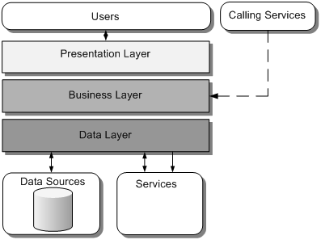

### Layer architecture

Key concepts:

- Separate functionalities
- Easy to refactor
- Not mengled
- Unique responsibilities
- Sometimes a layer might be open if different kinds of requests doesn't need
access to it. (80-20 rule: if 20% or more of the requests do not need a layer
it is and indicative that it could be open)

